# FitTrack Pro Database Schema

```mermaid
erDiagram
    LOCATIONS {
        int location_id PK
        string name
        string address
        string phone_number
        string email
        string opening_hours
    }
    MEMBERS {
        int member_id PK
        string first_name
        string last_name
        string email
        string phone_number
        date date_of_birth
        date join_date
        string emergency_contact_name
        string emergency_contact_phone
    }
    STAFF {
        int staff_id PK
        string first_name
        string last_name
        string email
        string phone_number
        string position
        date hire_date
        int location_id FK
    }
    EQUIPMENT {
        int equipment_id PK
        string name
        string type
        date purchase_date
        date last_maintenance_date
        date next_maintenance_date
        int location_id FK
    }
    CLASSES {
        int class_id PK
        string name
        string description
        int capacity
        int duration
        int location_id FK
    }
    CLASS_SCHEDULE {
        int schedule_id PK
        int class_id FK
        int staff_id FK
        datetime start_time
        datetime end_time
    }
    MEMBERSHIPS {
        int membership_id PK
        int member_id FK
        string type
        date start_date
        date end_date
        string status
    }
    ATTENDANCE {
        int attendance_id PK
        int member_id FK
        int location_id FK
        datetime check_in_time
        datetime check_out_time
    }
    CLASS_ATTENDANCE {
        int class_attendance_id PK
        int schedule_id FK
        int member_id FK
        string attendance_status
    }
    PAYMENTS {
        int payment_id PK
        int member_id FK
        decimal amount
        datetime payment_date
        string payment_method
        string description
    }
    PERSONAL_TRAINING_SESSIONS {
        int session_id PK
        int member_id FK
        int staff_id FK
        date session_date
        time start_time
        time end_time
        string notes
    }
    MEMBER_HEALTH_METRICS {
        int metric_id PK
        int member_id FK
        date measurement_date
        decimal weight
        decimal body_fat_percentage
        decimal muscle_mass
        decimal bmi
    }
    EQUIPMENT_MAINTENANCE_LOG {
        int log_id PK
        int equipment_id FK
        date maintenance_date
        string description
        int performed_by FK
    }
```

## Interpreting the Schema

1. Entities: Each table in the database is represented as an entity (box) in the diagram. For example, LOCATIONS, MEMBERS, STAFF, and EQUIPMENT are all entities in our FitTrack Pro schema.
2. Attributes: The attributes (columns) of each entity are listed within the entity box. The data type of each attribute is also specified. For instance, the MEMBERS entity has attributes like member_id, first_name, last_name, email, etc.
3. Primary Keys: Primary keys are indicated with "PK" after the attribute name. For example, in the LOCATIONS entity, location_id is marked with PK, indicating it's the primary key for that table.
4. Foreign Keys: Foreign keys are indicated with "FK" after the attribute name. For instance, in the STAFF entity, location_id is marked with FK, showing it's a foreign key referencing the LOCATIONS table.
5. Relationships: The lines between entities represent relationships. The symbols at the ends of these lines indicate the type of relationship:

6. `||--o{` means "one-to-many" relationship
7. For example, `LOCATIONS ||--o{ STAFF : employs` means one location can employ many staff members

6. Relationship Labels: The text on the relationship lines describes the nature of the relationship. For instance:

1. `MEMBERS ||--o{ MEMBERSHIPS : has` indicates that one member can have many memberships
2. `STAFF ||--o{ CLASS_SCHEDULE : instructs` shows that one staff member can instruct many classes in the schedule

7. Complex Relationships: Some entities have multiple relationships. For example, the MEMBERS entity is connected to several other entities, showing that members interact with many aspects of the gym system (memberships, attendance, class attendance, payments, personal training sessions, and health metrics).
8. Specialized Entities: Some entities represent specific events or logs. For instance, EQUIPMENT_MAINTENANCE_LOG is related to both EQUIPMENT and STAFF, tracking which staff member performed maintenance on which piece of equipment.
